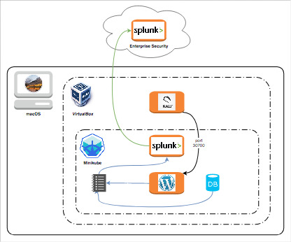

# Security Topic Team

Pen-testing playground lab.



What you get:

  - Homebrew, VirtualBox, Docker, Vagrant, Minikube
  - Kali Linux (in VirtualBox)
  - Slunk (Minikube K8s cluster)
  - Wordpress (Minikube K8s cluster)
  - Integration with Splunk Enterprise Security
  - [Documentation notes](docs/Phantom.md) for manual installation of Phantom (Community edition of Splunk Enterprise Security)
  - [Documentation for advanced topics](docs/Advanced%20topics.md) such as Vagrant with VMWare, tunnels, etc

To do:

  - Add an architecture diagram

## Pre-requisites

### Recommended hardware specifications

  - 16 GB RAM
  - 8 core CPU
  - 30 GB storage

### Splunk Enterprise Security (aka "SES")

This is simpler than setting up Phantom (see separate document in the [docs](docs/Phantom.md) folder) but currently the trial only lasts 7 days...

Sign up for the Trial (Cloud):

  - https://www.splunk.com/page/sign_up/es_sandbox?redirecturl=%2Fgetsplunk%2Fes_sandbox

### Splunk Enterprise Security (aka "SES") Forwarder Credentials

To enable the Minikube K8s cluster's Splunk instance to send events to SES, you will need your SES Universal Forwarder credentials.

Once your instance of SES is running, log on to its Web UI, and:

  - Click Apps in the menu bar at the top of the web page > Universal Forwarder
  - Click the 'Download Universal Forwarder Credentials' button, point number 3 (at time of writing).
  - This will download a file called `splunkclouduf.spl`. Keep it handy, you'll use it during set-up.

## Local set up instructions

To set up the lab on OSX, run:

```bash
./scripts/setup.sh
```

and follow the instructions the script displays.

At the end of the process, the script will display useful operational information.

## Practical operational information

### Minikube IP

The Minikube IP is displayed during the set-up. After that you can run this command to find it again:

```bash
minikube ip
```

### Kali Linux

The login user is `vagrant` and the password is `vagrant`, change it manually after the first logon.

You can log on using `vagrant ssh` (from the Kali_Linux directory) or you can use the Gnome desktop via the VirtualBox Manager (i.e. the VirtualBox icon in your OSX Application).

To access the root user, use `sudo -s` form a terminal window.

Useful reference:

  - https://www.kali.org/news/kali-linux-metapackages/
  - https://tools.kali.org/tools-listing
  
You can access the Wordpress service from Kali on:

  - http://`minikube_ip`:30100
    - e.g.: http://192.168.99.100:30100
  - https://`minikube_ip`:30101
    - e.g.: https://192.168.99.100:30101
    - you will likely require to export the cert from wordpress and import it where necessary.

### Splunk Enterprise

Splunk is exposed at:

  - http://`minikube_ip`:30700
    - e.g.: http://192.168.99.100:30700

Log in the Web UI as user `admin` with the password you keyed in during set-up.
